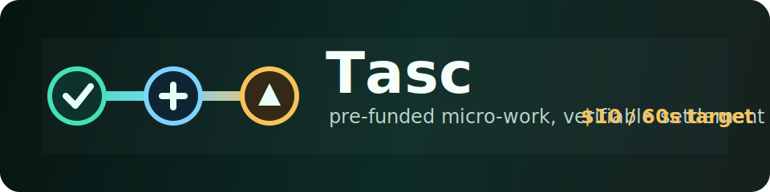
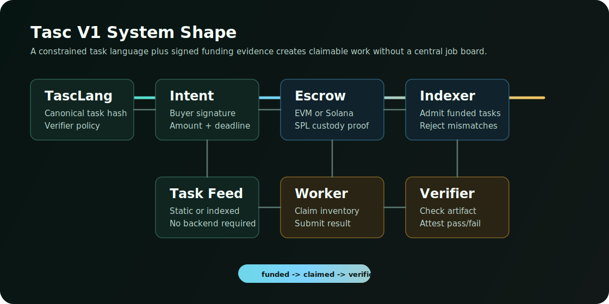
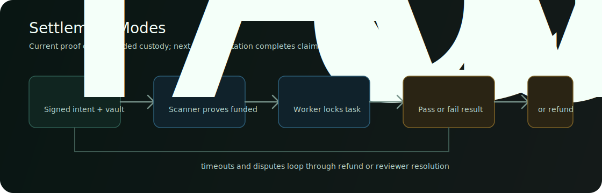

<p align="center">
  
</p>

<p align="center">
  <a href="https://github.com/hexcreator/tasc"></a>
  
  
  
  
</p>

# Tasc

Tasc is an early protocol prototype for instant micro-work: buyers publish pre-funded tasks, workers claim and complete them, verifiers check the result, and escrow pays out when proof passes.

The target is deliberately narrow: make small jobs, like `$10` tasks, globally claimable in about a minute. That only works if the work is already funded or payment-authorized before a worker starts.

> This repository is a research/devnet prototype. It is not audited, not mainnet-ready, and not safe for real funds yet.

## What Exists Now

Tasc currently proves the hard protocol boundary: a task can be compiled, signed, funded, scanned, and admitted as claimable inventory only when funding evidence matches the buyer intent.

| Layer | Current Proof |
| --- | --- |
| Task language | `TascLang` compiles a constrained task contract into canonical JSON and a stable task hash. |
| Buyer authorization | EIP-712 and Solana Ed25519 signed intents bind task hash, input hash, amount, token, deadline, verifier, and nonce. |
| Settlement | EVM escrow surface plus Solana devnet program/account model. |
| Solana custody | Live devnet SPL `TransferChecked` into a fresh task vault. |
| Indexer gate | Funding evidence is admitted only when it matches the signed intent and custody proof. |
| Static discovery | Browser-side scanner/feed proof with JSON index import, signed task inputs, and no hosted backend requirement. |
| Worker proof | Browser-side markdown submission capture derives verifier-compatible result hashes and proof JSON. |
| Verifier bridge | Captured worker proof JSON ingests into `tasc.attestation` plus Solana-ready attest hashes. |
| Verifier API | Dependencyless HTTP wrapper exposes proof ingestion at `/v1/ingest`, and the static app can submit captured proofs to it. |
| Wallet operator | Browser-side Solana claim/attest/release/refund/timeout-refund transaction construction behind an explicit send guard. |

Current live Solana SPL proof:

```text
program id:   FAqKhKke5pZr4TK6kXq9aKR98hWFy19SMQG9eGfXQrRM
fund tx:      zhrqMMYfXQAK37hLVkuvmqNwb2VzkdM4ZyHZMhpBhci97j3L38A7dswKhA9PsjimMPEFczf9NoWu5pR4jnudsm1
task account: 37hA4KUeR6eLPP1g1mBoTMYHKCPq7LECpLryQc61TmRi
vault token:  ChfKa5tEUjeSdaEhmjiDCWQE1Q6YT1oVaZt62HHR43b4
claim tx:     3eQLPK2SsMFJySopM6W27YapKLAoxdFANy9qjf4JjoXe3suSt8yZLZrruFCTzBfqAkF4MvXPNieFQFasSoY4rBG6
attest tx:    4ttsWrawCvg3v981Yyrsy8SYpr9ayzYmfLeVK72bvQmUBEHaaGyEiVCE9MLY3hYiTtR1ZZrS3NmMSsBnYA9sMUw1
worker token: 8KJmiwZR42u5pv5CKkxap6qFE1LYu4bKKye5DWXxbUJ8
amount:       10000000 base units
index:        examples/index/solana.spl.live.index.json
release plan: examples/solana-devnet/summarize_url_spl.release-plan.live.json
```

## Architecture

<p align="center">
  
</p>

The protocol keeps the task definition chain-agnostic. Settlement adapters can target EVM or Solana, but every claimable task must pass the same admission rule:

```text
signed buyer intent + matching funding evidence -> claimable task index
```

## Quick Start

Requirements:

- Node.js 20+
- npm
- Rust/Cargo only for the Solana source validator
- Solana CLI only for live devnet deploy/send flows

Install dependencies:

```sh
npm install
```

Run the safe local demo:

```sh
npm run demo
```

Or run the same pieces manually:

```sh
npm run compile:example
npm run verify:example
npm run demo:market
npm run validate:indexer
npm run validate:verifier-ingest
npm run validate:verifier-api
npm run validate:solana-spl-escrow
npm run validate:dependencies
```

Inspect the task language:

```sh
node bin/tasclang.js compile examples/summarize_url.tasc
```

Inspect the existing live Solana SPL custody proof without sending transactions:

```sh
npm run devnet:proof
```

The output is a worker-facing claimable index entry at:

```text
examples/index/solana.spl.live.index.json
```

## Example Task

```tasc
tasc summarize_url {
  version "0.1"
  reward 10 USDC
  deadline 60s

  input url string
  output markdown string

  verify {
    min_words 120
    contains_citation input.url
    no_duplicate worker
  }

  payout {
    pass -> worker
    timeout -> buyer
    dispute -> reviewers(3)
  }
}
```

## Settlement Flow

<p align="center">
  
</p>

The implemented local simulation covers:

```text
funded -> claimed -> passed -> released
```

The live Solana devnet path currently covers:

```text
signed intent -> SPL vault custody -> funded task account -> scanner -> claimable index -> live claim -> live verifier attest -> live program-signed SPL release/refund -> completed index
```

The current Solana program and CLI support program-signed SPL Token `TransferChecked` CPI for `release` and `refund`. Live devnet proofs have released `10000000` token base units from a PDA-owned vault to the worker token account, and refunded `10000000` token base units from a fresh failed task back to the buyer token account.

The timeout-aware Solana artifact also enforces Clock-backed claim deadlines and timeout refund eligibility for `Funded` or `Claimed` tasks. A live devnet timeout refund proof now refunds an overdue funded task back to the buyer without a worker claim or verifier failure.

The static browser operator console can now import index/proof artifacts, show the signed input URL plus verifier rules for each task, capture markdown output as `tasc.worker.submission` proof JSON, derive the verifier-compatible result hash, submit that proof to the verifier API, persist the returned `tasc.verifier.ingestion`, fill the Solana attest verdict/hash controls, build the same Solana lifecycle transaction payloads without runtime dependencies, and submit them through an injected wallet provider. The verifier ingestion path has a dependencyless HTTP API wrapper:

```bash
TASC_VERIFIER_API_TOKEN=dev-token \
npm run verifier:api
```

That starts the verifier with bearer-token auth, a persistent duplicate ledger at `.tascverifier/ledger.json`, and durable ingestion artifacts under `.tascverifier/artifacts/`. Enter the API URL and bearer token in the static app's Verifier API panel, capture a worker proof, then use `Submit to Verifier` to call `POST /v1/ingest` from the browser.

For the local private-beta operator session, run:

```bash
npm run beta:plan
npm run beta:local
npm run beta:qa
npm run beta:feed
npm run beta:claimable:plan
npm run beta:session:plan
```

`beta:local` serves the static app and verifier API together on localhost, prints the app URL, verifier URL, local config URL, and bearer token, writes verifier artifacts under `.tascverifier/`, and lets the app auto-fill the Verifier API panel from same-origin local config. After a wallet-extension run, use `Export QA Evidence` to download a redacted `tasc.private_beta.qa_evidence` bundle with feed state, verifier results, and wallet transaction signatures.

`beta:feed` builds the same-origin static feed bundle at `web/feed/proof-feed.json`. The static app's `Load Hosted Feed` button fetches that bundle without a backend, so `web/` can be served by free static hosting. After a fresh devnet proof run, rebuild the hosted feed with:

```bash
npm run beta:feed -- --proof-summary examples/solana-devnet/proofs/<run-id>/proof-summary.json
```

For active private-beta inventory, plan a fresh funded 60-second claimable task with:

```bash
npm run beta:claimable:plan
npm run beta:session:plan
```

The live path is guarded by `GLOBAL_TASC_ALLOW_BETA_CLAIMABLE_PUBLISH=1`. When run, it creates a fresh devnet SPL test-token task, admits it as claimable inventory, and publishes `web/feed/claimable-feed.json`. The static app tries that active feed before falling back to the completed proof feed.

Use `beta:session` when you are ready for wallet-extension QA against a fresh active task:

```bash
GLOBAL_TASC_ALLOW_BETA_CLAIMABLE_PUBLISH=1 npm run beta:session
```

That command publishes a fresh active claimable feed, starts the localhost static app plus verifier API, and points the verifier at `web/feed/active.claimable.index.json` so worker proof ingestion trusts the same task the browser loads through `Load Hosted Feed`.

`beta:qa` prints the wallet QA runbook when no evidence path is provided. Validate a real exported bundle with:

```bash
npm run beta:qa -- ~/Downloads/tasc-private-beta-qa.json \
  --solana-rpc-url https://api.devnet.solana.com
```

That wrapper enforces wallet-send, verifier-ingestion, worker-proof, live-account, and Solana RPC checks. Use `--offline` only for a local schema check; it does not count as a final wallet QA pass.

Headless validation covers the bytes, API auth/persistence behavior, guarded UI, mock wallet-provider submission transports, local verifier auto-fill, QA evidence export wiring, QA evidence redaction checks, optional Solana RPC evidence checks, the local beta launcher, the active-session runner, and the guided QA runner; a real wallet-extension QA pass is still required before treating this as beta-ready UX.

## Repository Map

| Path | Purpose |
| --- | --- |
| `bin/` | Dependency-light CLI tools, validators, scanners, and live devnet harnesses. |
| `contracts/` | Solidity escrow and local ERC-20 test token. |
| `programs/solana-tasc/` | Dependencyless Rust core for Solana task account and instruction bytes. |
| `examples/` | Task specs, signed intents, funding evidence, live devnet scans, and admitted indexes. |
| `docs/` | Protocol, settlement, scanner, release, and operational notes. |
| `web/` | Static browser scanner/feed and Solana operator proof. |
| `assets/` | Repository SVGs and diagrams. |

Useful docs:

- [Protocol V1](docs/protocol-v1.md)
- [Solana Devnet V1](docs/solana-devnet-v1.md)
- [Indexer Admission V1](docs/indexer-admission-v1.md)
- [Release Modes](docs/release-modes.md)
- [Adoption Plan](docs/adoption-plan.md)
- [Contributing](CONTRIBUTING.md)

## Reproduce The Devnet Proof

The live Solana mechanics can now be packaged as a fresh proof bundle. The safe plan mode does not send transactions:

```bash
npm run prove:solana-devnet:plan
```

The live runner creates fresh task hashes, sets up a devnet SPL test mint, proves release, failure refund, and timeout refund, scans the resulting accounts, and writes completed index evidence under the ignored `examples/solana-devnet/proofs/` directory:

```bash
GLOBAL_TASC_ALLOW_SOLANA_DEVNET_PROOF=1 npm run prove:solana-devnet
```

Do this only with devnet keys and funded devnet SOL balances.

To measure the actual under-60-second payout path on devnet test tokens, use the 60-second command alias:

```bash
npm run earn:devnet:plan
GLOBAL_TASC_ALLOW_SOLANA_DEVNET_PROOF=1 npm run earn:devnet
```

The generated `proof-summary.json` includes `timed_payout`, with claim-to-release timing, claim-to-completed-index timing, the worker destination token account, and explicit `under_60s` booleans. This is still devnet/test-token evidence, not real-money income.

Validate a generated timed proof with:

```bash
npm run validate:timed-payout -- examples/solana-devnet/proofs/<run-id>/proof-summary.json
```

Check whether the real `$10 in less than a minute` goal is actually ready:

```bash
npm run real:preflight:plan
npm run real:preflight -- \
  --production-rpc-url <mainnet-rpc-url> \
  --expected-genesis-hash <mainnet-genesis-hash> \
  --program-id <program-id> \
  --usdc-mint <mainnet-usdc-mint> \
  --buyer <buyer-wallet> \
  --worker <worker-wallet> \
  --verifier <verifier-wallet> \
  --buyer-usdc-token-account <buyer-usdc-account> \
  --worker-usdc-token-account <worker-usdc-account>

npm run real:payout:plan
npm run real:payout:build -- \
  --token-mint <mainnet-usdc-mint> \
  --task-account <task-account> \
  --vault-token-account <vault-token-account> \
  --destination-token-account <worker-token-account> \
  --fund-signature <sig> \
  --claim-signature <sig> \
  --attest-signature <sig> \
  --release-signature <sig> \
  --claim-to-release-ms <ms> \
  --claim-to-completed-index-ms <ms> \
  --production-rpc-url <mainnet-rpc-url>

npm run real:readiness:plan
npm run real:readiness -- \
  --timed-proof examples/solana-devnet/proofs/<run-id>/proof-summary.json \
  --production-payout .tascverifier/production-payout-evidence.json \
  --production-rpc-url <mainnet-rpc-url> \
  --expected-genesis-hash <mainnet-genesis-hash>
```

`real:preflight` is a read-only mainnet safety gate. It verifies the RPC genesis hash, deployed program account, role SOL balances, verified USDC mint, buyer USDC balance, and worker USDC destination account without accepting private keys or printing the full RPC URL. `real:payout:build` then creates the ignored local production payout artifact from mainnet signatures/accounts and optionally reads final token balances from RPC. It never accepts private keys, never sends transactions, and never writes the full RPC URL into the artifact. `real:readiness` accepts the devnet timed proof as a prerequisite, but it refuses to mark the goal ready until the non-example mainnet USDC payout artifact proves funding, claim, attest, release, post-release balances, under-60-second timing, and live RPC verification. The live check verifies the RPC genesis hash, transaction confirmations, and SPL token-account balances without printing the full RPC URL. The schema example lives at `examples/private-beta/production-payout-evidence.example.json`.

## Why Tasc Might Work

Most micro-work systems fail on trust and timing. Workers do not want to wait for payment, and buyers do not want to pay before proof. Tasc narrows the problem:

- the buyer signs an exact task and funds escrow first
- the indexer publishes only signed-and-funded work
- the worker claims from a claimable feed, not a vague request list
- the verifier emits deterministic evidence
- the settlement layer releases or refunds according to task policy

The near-term product should not be "ask the world for $10." It should be "claim a pre-funded `$10` task and get paid as soon as verification passes."

## How To Help

The best first contributions are narrow and verifiable:

- harden live Solana `claim`, `attest`, `release`, and `refund`
- add dispute handling around release/refund eligibility
- harden duplicate-task, finality, and concurrency handling around the live Solana proofs
- publish fresh proof indexes as static feed artifacts with `npm run beta:feed`
- publish a fresh active claimable task feed with guarded `npm run beta:claimable`
- deploy the verifier API and feed its durable proof artifacts back into hosted task indexes
- live-test the guarded Solana operator console in wallet-extension browsers
- use `npm run beta:local` as the local operator session while testing Phantom/Solflare flows
- add more TascLang task examples with deterministic verifier rules
- build an indexer process that watches live Solana task accounts
- package the CLI so people can create and sign tasks without reading the internals
- write walkthroughs for buyers, workers, verifiers, and indexer operators

Start with [CONTRIBUTING.md](CONTRIBUTING.md), then pick one of the tracks in [docs/adoption-plan.md](docs/adoption-plan.md).

## Safety And Status

- Do not use this with mainnet funds.
- Devnet keys and RPC URLs must stay local in `.env*` files.
- Live transaction commands are guarded by explicit environment flags.
- Current npm production dependency audit reports zero vulnerabilities.
- Runtime code avoids framework dependencies where practical.
- Licensed under Apache-2.0.
